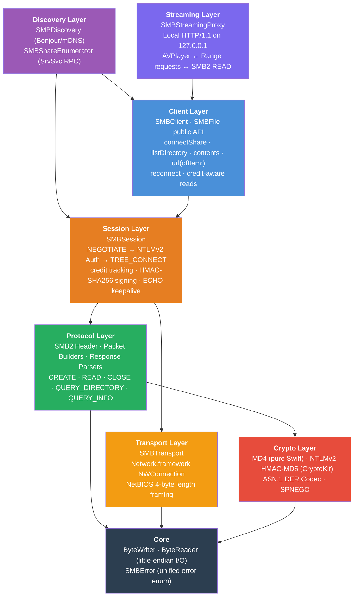
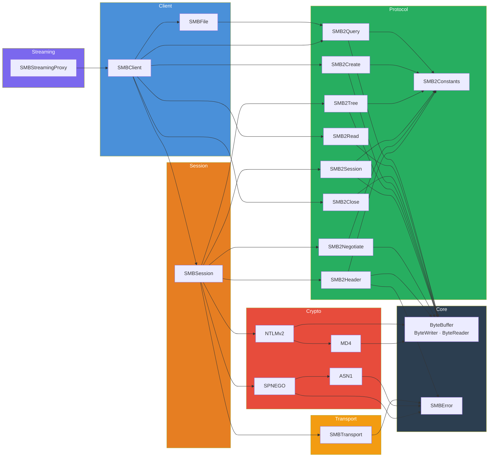
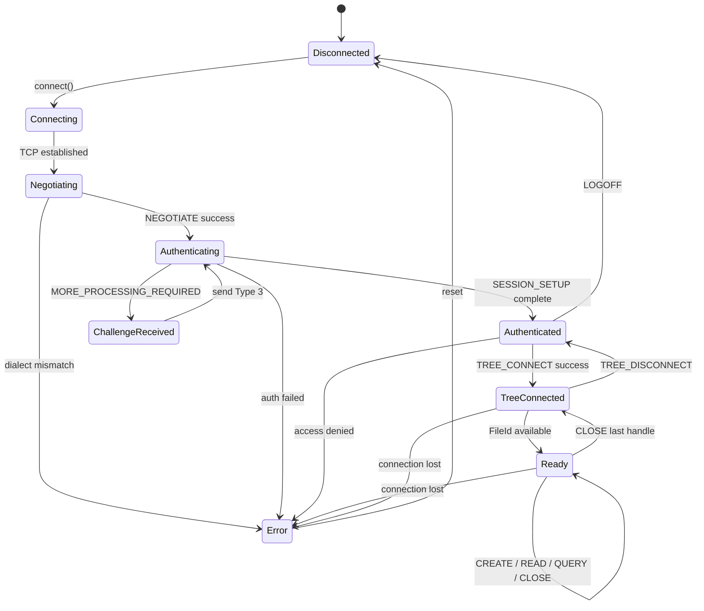
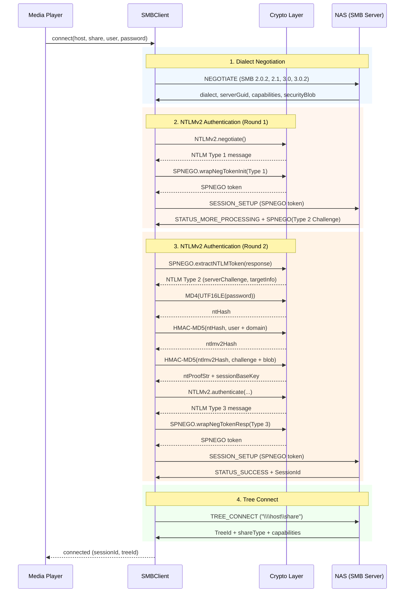
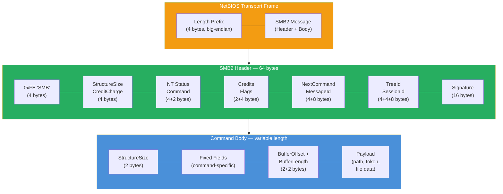
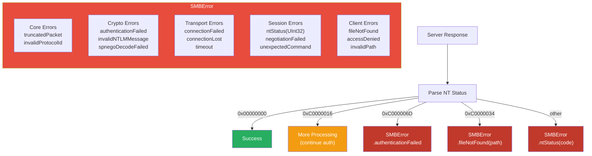

# SwiftSMB

A pure Swift SMB2/3 client library for Apple platforms. Browses and streams videos and photos from SMB shares on a NAS.

## Platforms

- tvOS 17+
- iOS 17+
- macOS 14+

## Installation

Add SwiftSMB to your project via Swift Package Manager:

```swift
dependencies: [
    .package(url: "https://github.com/dmplng-bits/SwiftSMB.git", from: "0.1.0")
]
```

## Quick Start

```swift
import SwiftSMB
import AVKit

let client = SMBClient(host: "192.168.1.100")

// Connect and authenticate
try await client.connectShare(
    "Videos",
    credentials: SMBCredentials(user: "me", password: "secret")
)

// Browse
let movies = try await client.listDirectory("Movies")
for movie in movies where !movie.isDirectory {
    print("\(movie.name) — \(movie.size) bytes")
}

// Stream with AVPlayer
let url = try await client.url(ofItem: "Movies/Inception.mkv")
let player = AVPlayer(url: url)
player.play()

// Read an entire file
let photoData = try await client.contents(atPath: "Photos/sunset.jpg")

// Or read just the first 64 KB (e.g. for EXIF thumbnail extraction)
let header = try await client.contents(
    atPath: "Photos/sunset.jpg",
    range: 0..<65536
)

// SMBFile overloads — skip the path string
let photos = try await client.listDirectory("Photos")
if let first = photos.first(where: { $0.fileExtension == "jpg" }) {
    let data = try await client.contents(of: first)
    let thumb = try await client.contents(of: first, range: 0..<65536)
    let streamURL = try await client.url(of: first)
}

// Write data to a file
let noteData = Data("Hello from Navi!".utf8)
try await client.uploadFile(noteData, toPath: "notes.txt")

// Rename a file
try await client.rename(atPath: "notes.txt", toPath: "greeting.txt")

// Create a directory
try await client.createDirectory("Favorites")

// Watch a directory for changes
let watcher = try await client.watchDirectory("Photos") { changes in
    for change in changes {
        print("\(change.action): \(change.fileName)")
    }
}
// Later: await watcher.stop()

// Delete a file
try await client.deleteFile(atPath: "greeting.txt")

await client.disconnect()
```

## Public API

The top-level facade is `SMBClient`. It's an actor, so it's safe to share across concurrent callers.

- `SMBClient(host:port:)` — create a client bound to a server.
- `connectShare(_:credentials:)` — connect TCP, run NEGOTIATE → NTLMv2 → TREE_CONNECT.
- `listDirectory(_:)` — enumerate a directory and return `[SMBFile]`.
- `fileSize(at:)` — return a file's size in bytes without reading any data.
- `contents(atPath:)` — read an entire file into memory.
- `contents(atPath:range:)` — read a byte range from a file (partial read).
- `url(ofItem:)` — mint an `http://127.0.0.1:…` streaming URL for AVPlayer.
- `contents(of:)` / `contents(of:range:)` — same as above but accept an `SMBFile` directly.
- `fileSize(of:)` — uses cached size from directory listing, falls back to wire query.
- `url(of:)` — streaming URL from an `SMBFile`.
- `reconnect()` — transparently rebuild the full session after a disconnect.
- `disconnect()` — tear down the tree, session, and socket.
- `writeData(_:toPath:offset:)` — write data to a file at a given offset, creating it if needed.
- `uploadFile(_:toPath:)` — upload and overwrite a remote file.
- `createDirectory(_:)` — create a directory on the share.
- `rename(atPath:toPath:replaceIfExists:)` — rename or move a file/directory.
- `deleteFile(atPath:)` — delete a file.
- `deleteDirectory(atPath:)` — delete an empty directory.
- `watchDirectory(_:watchTree:filter:onChange:)` — watch for real-time file system changes via CHANGE_NOTIFY.
- `delete(_:)` / `rename(_:toPath:)` — SMBFile convenience overloads.

`SMBFile` carries the file name, path, size, attributes, and Windows FILETIME timestamps converted to `Date`.

### Server Discovery

```swift
let discovery = SMBDiscovery()
let servers = try await discovery.scan(duration: 3)
for server in servers {
    print("\(server.name) at \(server.host)")
}
```

### Share Enumeration

```swift
let shares = try await SMBShareEnumerator.listShares(
    host: "192.168.1.100",
    credentials: SMBCredentials(user: "me", password: "secret")
)
for share in shares where share.isDisk && !share.isSpecial {
    print(share.name)  // "Videos", "Photos", "Music", …
}
```

### Production Features

- **SMB2 credit tracking** — correct credit charge computation for large READ/WRITE/QUERY_DIRECTORY operations, with per-request balance checking per [MS-SMB2] §3.2.4.1.5.
- **Message signing** — HMAC-SHA256 on all outgoing packets when the server requires signing (SMB 2.x and 3.x). Inbound signatures are verified.
- **ECHO keepalive** — background ECHO pings every 30 s (configurable) prevent the server from timing out idle sessions.
- **Automatic reconnect** — `reconnect()` rebuilds TCP + NEGOTIATE + auth + tree using stored credentials.
- **Bonjour discovery** — `SMBDiscovery` finds SMB servers on the LAN via `_smb._tcp.` mDNS without the user typing an IP.
- **Share enumeration** — `SMBShareEnumerator` lists available shares on a server via SrvSvc RPC (NetShareEnumAll) over IPC$.
- **File write operations** — credit-aware chunked writes with `writeData` and `uploadFile` for creating and modifying files on the share.
- **File management** — rename, delete, and create directories via SMB2 SET_INFO and CREATE commands.
- **Directory watching** — real-time file system change notifications via SMB2 CHANGE_NOTIFY, avoiding polling.
- **Oplock/lease caching** — client-side read/handle caching via SMB2.1+ leases to reduce network round trips for repeated file access.
- **Compounded requests** — chain multiple SMB2 commands (e.g. CREATE+READ+CLOSE) in a single TCP round trip for lower latency.

---

## Layer Architecture

The library is organized into seven layers, each building on the one below it.



---

## Module Dependency Graph

How the Swift source files depend on each other.



---

## Connection State Machine

The lifecycle of an SMB2 connection from the client's perspective.



---

## SMB2 Authentication Sequence

The full NTLMv2 handshake wrapped in SPNEGO tokens.



---

## Data Flow: Video Streaming

How AVPlayer range requests are translated into SMB2 READ packets.

```mermaid
flowchart LR
    AVPlayer["AVPlayer\n(tvOS)"]
    Proxy["HTTP Proxy\n(localhost:port)"]
    Client["SMBClient"]
    Protocol["SMB2 READ\nPacket Builder"]
    Transport["TCP Socket\n(Network.framework)"]
    NAS["NAS\nSMB Server"]

    AVPlayer -- "HTTP GET\nRange: bytes=X-Y" --> Proxy
    Proxy -- "read(fileId, offset, length)" --> Client
    Client -- "build READ request" --> Protocol
    Protocol -- "64-byte header +\n49-byte body" --> Transport
    Transport -- "NetBIOS frame\n(4-byte length prefix)" --> NAS
    NAS -- "file bytes" --> Transport
    Transport -- "parse READ response" --> Protocol
    Protocol -- "extract data payload" --> Client
    Client -- "Data" --> Proxy
    Proxy -- "HTTP 206\nPartial Content" --> AVPlayer

    style AVPlayer fill:#4A90D9,color:#fff
    style Proxy fill:#7B68EE,color:#fff
    style Client fill:#E67E22,color:#fff
    style Protocol fill:#27AE60,color:#fff
    style Transport fill:#F39C12,color:#fff
    style NAS fill:#2C3E50,color:#fff
```



---

## SMB2 Packet Structure

Every SMB2 message is a 64-byte header followed by a variable-length command body.



---

## Error Handling Strategy

A single `SMBError` enum covers all layers, with cases declared upfront.



---

## File Structure

```
Sources/SwiftSMB/
├── Core/
│   ├── ByteBuffer.swift         # Little-endian binary I/O
│   └── SMBError.swift            # Unified error enum for all layers
├── Crypto/
│   ├── MD4.swift                 # Pure Swift MD4 (RFC 1320)
│   ├── NTLMv2.swift              # NTLMv2 auth + HMAC-MD5 via CryptoKit
│   ├── ASN1.swift                # ASN.1 DER encoder/decoder
│   └── SPNEGO.swift              # SPNEGO token wrapping/parsing
├── Protocol/
│   ├── SMB2Constants.swift       # Commands, flags, dialects, capabilities
│   ├── SMB2Header.swift          # 64-byte SMB2 header builder/parser
│   ├── SMB2Negotiate.swift       # NEGOTIATE request/response
│   ├── SMB2Session.swift         # SESSION_SETUP, LOGOFF
│   ├── SMB2Tree.swift            # TREE_CONNECT/DISCONNECT
│   ├── SMB2Create.swift          # CREATE (open file) request/response
│   ├── SMB2Close.swift           # CLOSE request/response
│   ├── SMB2Read.swift            # READ request/response
│   ├── SMB2Write.swift           # WRITE request/response
│   ├── SMB2Query.swift           # QUERY_DIRECTORY, QUERY_INFO
│   ├── SMB2SetInfo.swift         # SET_INFO (rename, delete)
│   ├── SMB2ChangeNotify.swift    # CHANGE_NOTIFY request/response
│   └── SMB2Lease.swift           # Lease create context (client caching)
├── Transport/
│   └── SMBTransport.swift        # TCP + NetBIOS 4-byte framing
├── Session/
│   ├── SMBSession.swift          # Handshake + request/response core
│   └── SMBCompoundBuilder.swift  # Compounded request builder
├── Client/
│   ├── SMBClient.swift           # Public high-level API
│   ├── SMBFile.swift             # File metadata struct
│   └── SMBDirectoryWatcher.swift # Real-time directory change watcher
├── Streaming/
│   └── SMBStreamingProxy.swift   # Local HTTP/1.1 proxy for AVPlayer
└── Discovery/
    ├── SMBDiscovery.swift        # Bonjour/mDNS server scanner
    └── SMBShareEnumerator.swift  # SrvSvc RPC share listing
```

## Design Decisions

- **Zero external dependencies.** Only Apple system frameworks (CryptoKit, Network.framework, Foundation).
- **Struct-based I/O.** ByteWriter and ByteReader are value types. Every SMB2 packet is built and parsed with these two structs.
- **Little-endian throughout.** SMB2 is entirely LE on the wire.
- **Pure Swift MD4.** Apple's CryptoKit doesn't include MD4, so we implement RFC 1320 ourselves. HMAC-MD5 uses CryptoKit.
- **Generic ASN.1 codec.** SPNEGO wrapping uses a proper ASN.1 DER encoder/decoder rather than hard-coded byte patterns.
- **One error enum.** SMBError covers all layers with cases declared upfront.
- **Credit-aware I/O.** Large reads compute the correct CreditCharge per [MS-SMB2] §3.2.4.1.5 and cap requests to the available balance.
- **Automatic signing.** After SESSION_SETUP, HMAC-SHA256 is applied to every packet if the server requires it. Inbound signatures are verified.
- **Idle keepalive.** Background ECHO pings prevent the server from dropping the session during movie pauses.
- **Full read-write support.** Beyond streaming, the package supports file creation, upload, rename, and deletion — everything needed for a complete file manager.
- **CHANGE_NOTIFY over polling.** Directory watching uses the SMB2 long-poll mechanism so the server pushes events instead of the client repeatedly listing.
- **Lease-based caching.** Requests RH leases on file opens to let the client cache reads locally, reducing round trips on repeated access.
- **Compound batching.** Multiple related commands can be chained in a single TCP message to cut latency for common patterns like open-read-close.

## License

MIT
