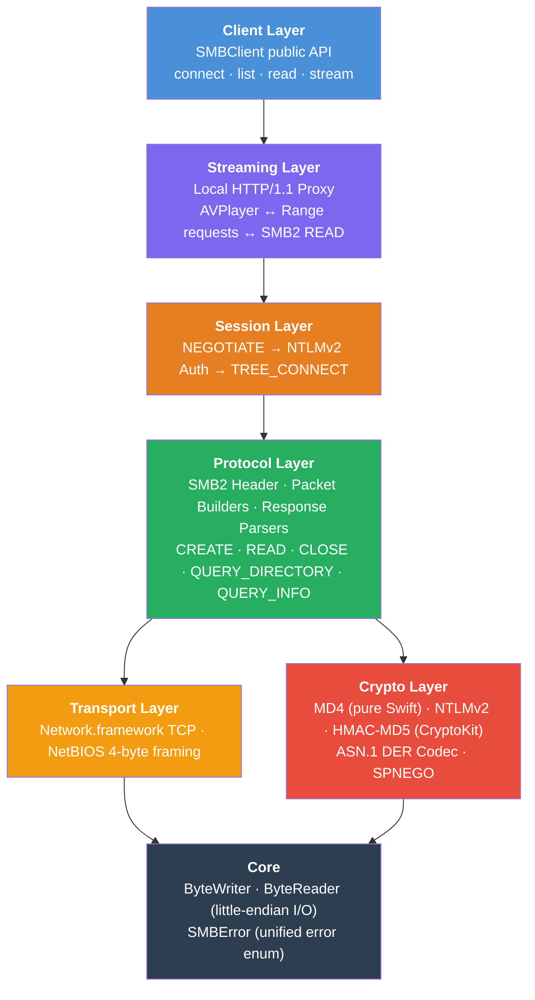
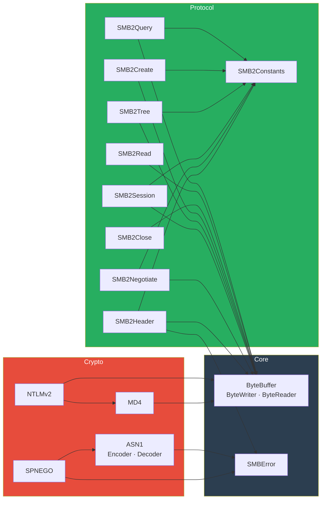
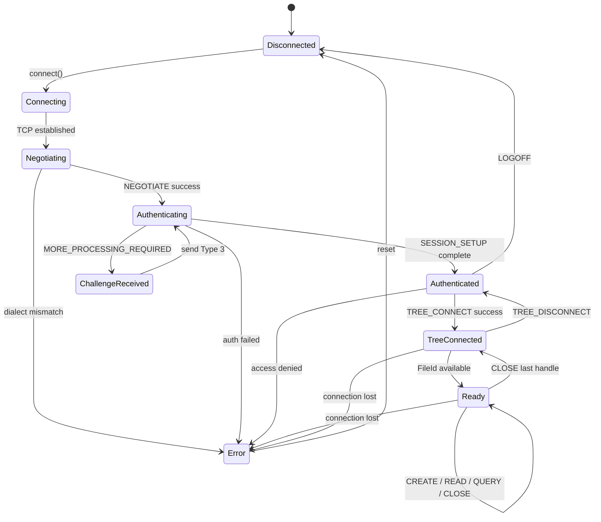
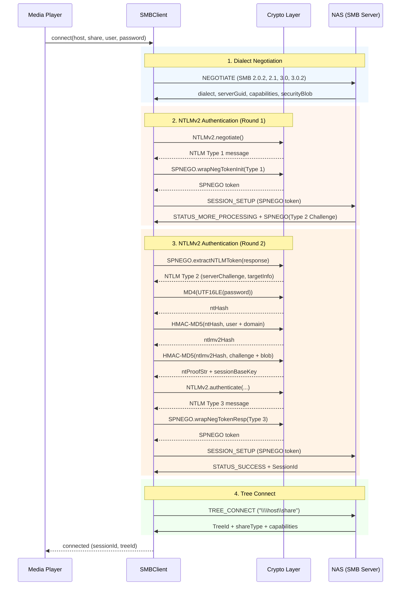
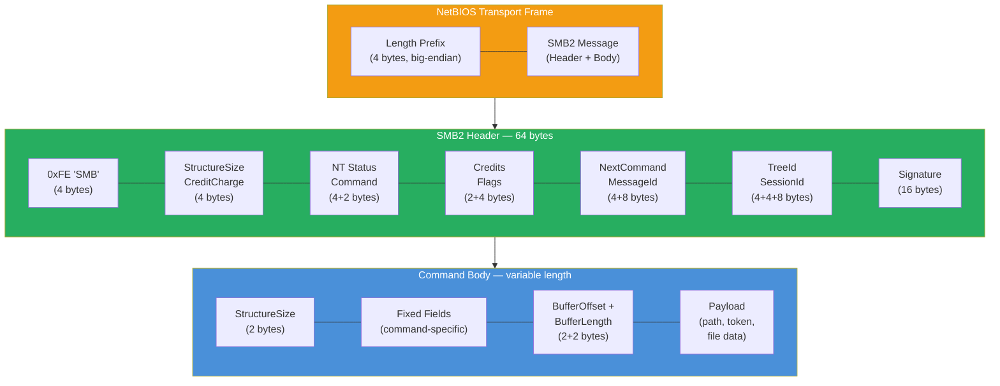
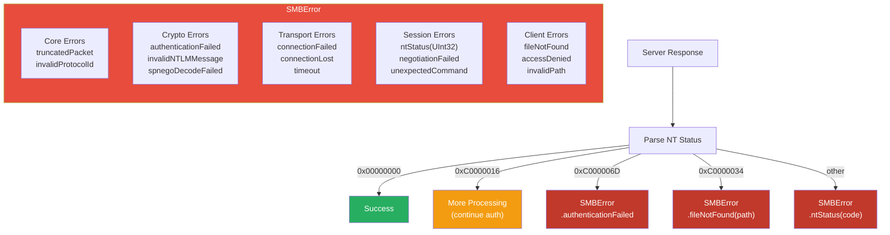

# SwiftSMB

A pure Swift SMB2/3 client library for Apple platforms. Browses and streams videos and photos from SMB shares on a NAS.

## Platforms

- tvOS 17+
- iOS 17+
- macOS 14+

## Installation

Add SwiftSMB to your project via Swift Package Manager:

```swift
dependencies: [
    .package(url: "https://github.com/dmplng-bits/SwiftSMB.git", from: "0.1.0")
]
```

---

## Layer Architecture

The library is organized into seven layers, each building on the one below it.



---

## Module Dependency Graph

How the Swift source files depend on each other.



---

## Connection State Machine

The lifecycle of an SMB2 connection from the client's perspective.



---

## SMB2 Authentication Sequence

The full NTLMv2 handshake wrapped in SPNEGO tokens.



---

## Data Flow: Video Streaming

How AVPlayer range requests are translated into SMB2 READ packets.

```mermaid
flowchart LR
    AVPlayer["AVPlayer\n(tvOS)"]
    Proxy["HTTP Proxy\n(localhost:port)"]
    Client["SMBClient"]
    Protocol["SMB2 READ\nPacket Builder"]
    Transport["TCP Socket\n(Network.framework)"]
    NAS["NAS\nSMB Server"]

    AVPlayer -- "HTTP GET\nRange: bytes=X-Y" --> Proxy
    Proxy -- "read(fileId, offset, length)" --> Client
    Client -- "build READ request" --> Protocol
    Protocol -- "64-byte header +\n49-byte body" --> Transport
    Transport -- "NetBIOS frame\n(4-byte length prefix)" --> NAS
    NAS -- "file bytes" --> Transport
    Transport -- "parse READ response" --> Protocol
    Protocol -- "extract data payload" --> Client
    Client -- "Data" --> Proxy
    Proxy -- "HTTP 206\nPartial Content" --> AVPlayer

    style AVPlayer fill:#4A90D9,color:#fff
    style Proxy fill:#7B68EE,color:#fff
    style Client fill:#E67E22,color:#fff
    style Protocol fill:#27AE60,color:#fff
    style Transport fill:#F39C12,color:#fff
    style NAS fill:#2C3E50,color:#fff
```



---

## SMB2 Packet Structure

Every SMB2 message is a 64-byte header followed by a variable-length command body.



---

## Error Handling Strategy

A single `SMBError` enum covers all layers, with cases declared upfront.



---

## File Structure

```
Sources/SwiftSMB/
├── Core/
│   ├── ByteBuffer.swift      # Little-endian binary I/O
│   └── SMBError.swift         # Unified error enum for all layers
├── Crypto/
│   ├── MD4.swift              # Pure Swift MD4 (RFC 1320)
│   ├── NTLMv2.swift           # NTLMv2 auth + HMAC-MD5 via CryptoKit
│   ├── ASN1.swift             # ASN.1 DER encoder/decoder
│   └── SPNEGO.swift           # SPNEGO token wrapping/parsing
└── Protocol/
    ├── SMB2Constants.swift    # Commands, flags, dialects, capabilities
    ├── SMB2Header.swift       # 64-byte SMB2 header builder/parser
    ├── SMB2Negotiate.swift    # NEGOTIATE request/response
    ├── SMB2Session.swift      # SESSION_SETUP request/response, LOGOFF
    ├── SMB2Tree.swift         # TREE_CONNECT/DISCONNECT
    ├── SMB2Create.swift       # CREATE (open file) request/response
    ├── SMB2Close.swift        # CLOSE request/response
    ├── SMB2Read.swift         # READ request/response
    └── SMB2Query.swift        # QUERY_DIRECTORY, QUERY_INFO
```

## Design Decisions

- **Zero external dependencies.** Only Apple system frameworks (CryptoKit, Network.framework, Foundation).
- **Struct-based I/O.** ByteWriter and ByteReader are value types. Every SMB2 packet is built and parsed with these two structs.
- **Little-endian throughout.** SMB2 is entirely LE on the wire.
- **Pure Swift MD4.** Apple's CryptoKit doesn't include MD4, so we implement RFC 1320 ourselves. HMAC-MD5 uses CryptoKit.
- **Generic ASN.1 codec.** SPNEGO wrapping uses a proper ASN.1 DER encoder/decoder rather than hard-coded byte patterns.
- **One error enum.** SMBError covers all layers with cases declared upfront.

## License

MIT
